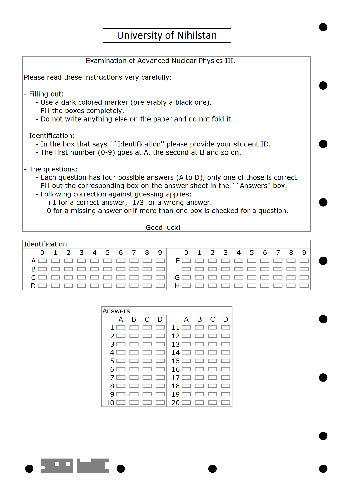

# MCDRI

MCDRI stands for "Multiple Choice Designer, Recognizer and Interpreter" allows you to design custom multiple choice tests or exames and make it very easy to correct the scanned results.

Directories:

- scr: The source code. The program is written in C#.
- doc: The manual. Check out manual.pdf if you want to know more about the program.
- setup: Contains a setup with the compiled program including the manual. If you just want to use the program and are not interested in the source then this is what you're after (the file setup.exe).

